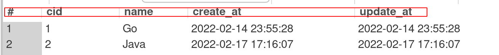

# 一、增删查改

## 1.1 insert插入数据

```go
// 插入数据
// input:等待插入的数据内容
func Save(username, sex, email string) {
	// 1. 准备语句
	stmt, _ := DB.Prepare("insert into testUser(username, sex, email) values (?,?,?)")
	// 2. 具体数据填充
	ret, err := stmt.Exec(username, sex, email) //返回插入是否成功的结果
	if err != nil {
		log.Println("插入失败")
	}
	// 返回插入的最后一行的id
	id, _ := ret.LastInsertId()
	log.Println("插入成功：", id)
}


func main() {
	defer DB.Close() //最后关闭数据库
	Save("宁心儿", "女", "3456789@sdfghj")
}
```


## 1.2 查询数据

1. 准备接收查询结果的结构体

   ```go
   // 获取查询到的结构体
   type User struct {
   	Id       int    `db:id` //后面指明在数据库中的列名，与数据库中名一致
   	Username string `username`
   	Sex      string `sex`
   	Email    string `email`
   }
   ```

   

2. 查询数据

```go
var user User

func query(id int) (*User, error) { //指针节约内存
    //1. 查询数据
	rows, err := DB.Query("select * from testUser where id=?", id) //查询到多行用rows
	if err != nil {
		log.Println("查询失败", err)
		return nil, err
	}
    //2. 遍历查询到的每一行（此处只有一行）
	for rows.Next() { 
    //3. 为查询结果赋值
		rows.Scan(&user.Id, &user.Username, &user.Sex, &user.Email) //将一行中的列的内容，赋值到结构体中
	}
	return &user, nil
}
```


## 1.3 更新数据


```go
// 3. update 与insert类似
func update(id int, username string) (int, error) {
	ret, err := DB.Exec("update testUser set username=? where id=?", username, id)
	if err != nil {
		log.Println("更新出错：", err)
		return 0, err
	}
	affect, _ := ret.RowsAffected() //成功修改了多少行
	log.Printf("成功修改了%d行", affect)
	return int(affect), nil
}
```


## 1.4 删除数据


```go
// 4. delete删除操作
func delete(id int) (int, error) {
	ret, err := DB.Exec("delete from testUser where id=?", id)
	if err != nil {
		log.Println("删除失败")
		return 0, err
	}
	affect, _ := ret.RowsAffected()
	log.Printf("成功删除%d行", affect)
	return int(affect), nil
}
```


### 参考链接

[码神之路](https://www.bilibili.com/video/BV1SS4y1T7kJ?p=81)


# 二、相关函数

### 2.1 rows.Scan()

将查询的值（一行）， 按列赋值给对象， 


```go
func (r *Row) Scan(dest ...interface{}) error {
```

其中,

- **1. 赋值顺序按照数据库中列的顺序！！！！！**
- **2. 被赋值的对象个数必须与数据库列的个数一致！！！**

比如， 数据库中顺序是cid、name、created_at、....

在赋值也要按照这个顺序：

```go
var user
row.Scan(
    &user.cid,
    &user.Name,......
)
```




# 三、error一些错误

### 2.1 插入出错

```bash
插入失败 Error 1054: Unknown column '？' in 'field list'
```

**错误原因**：

**列名对不上**，

1. 比如创建列名" id" id前有空格，但在go插入时没有，因此不匹配。

2. 列举value时候 ？ 是中文的

   ```go
   ret, err := DB.Exec("insert into brkBlog.testUser(username,sex,email) values (?,？,?)", username, sex, email) //中间的问号是中文版的
   ```


