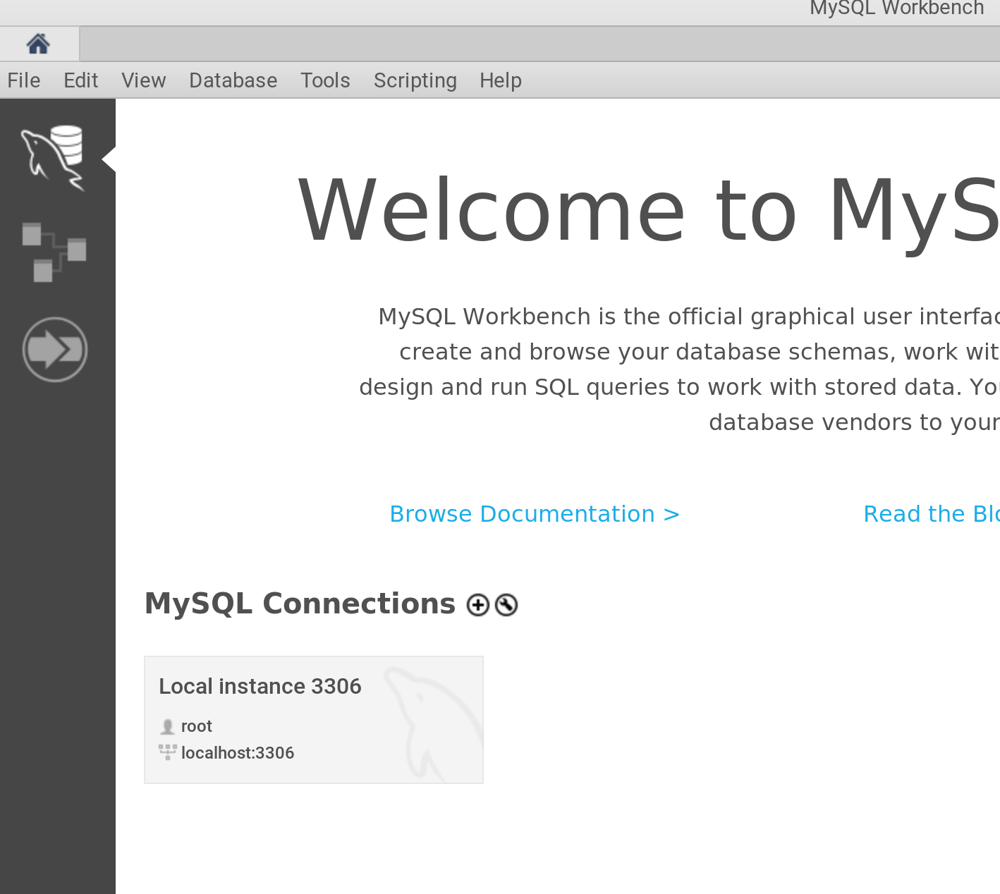
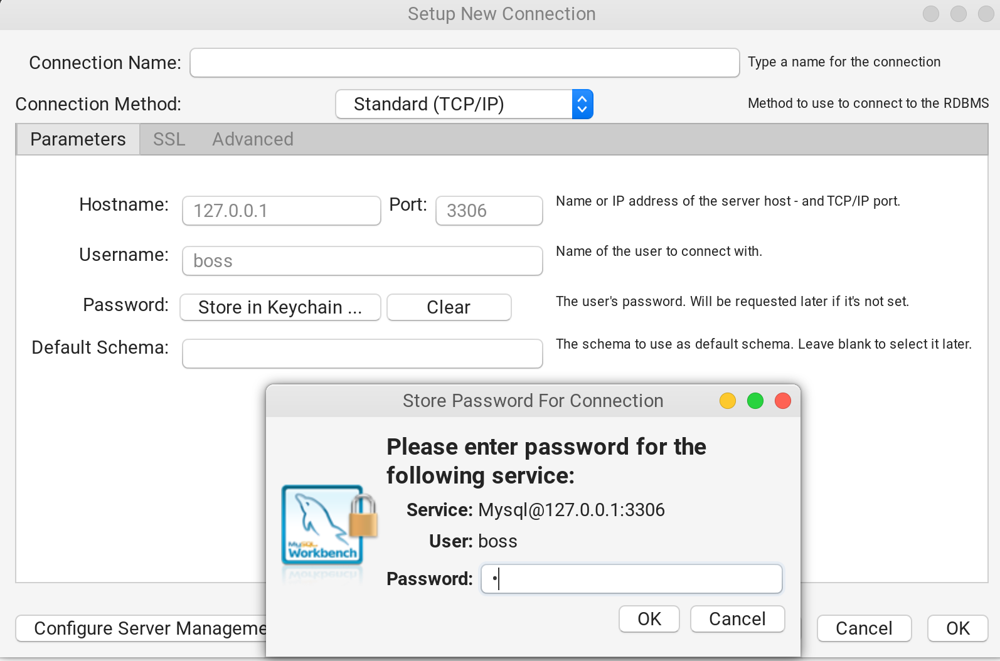
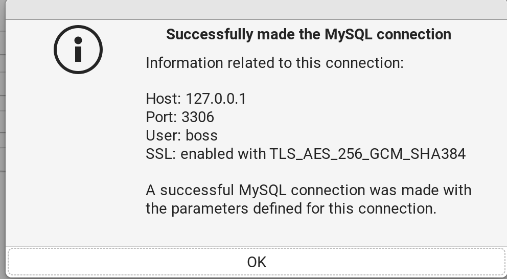
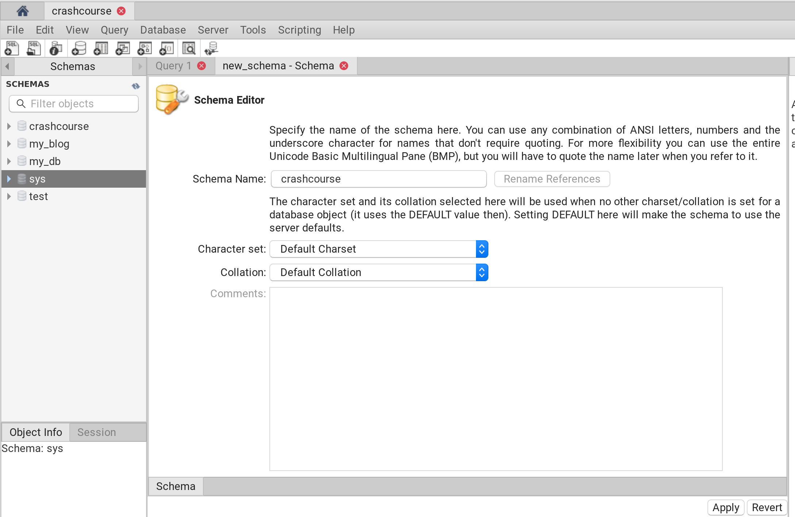
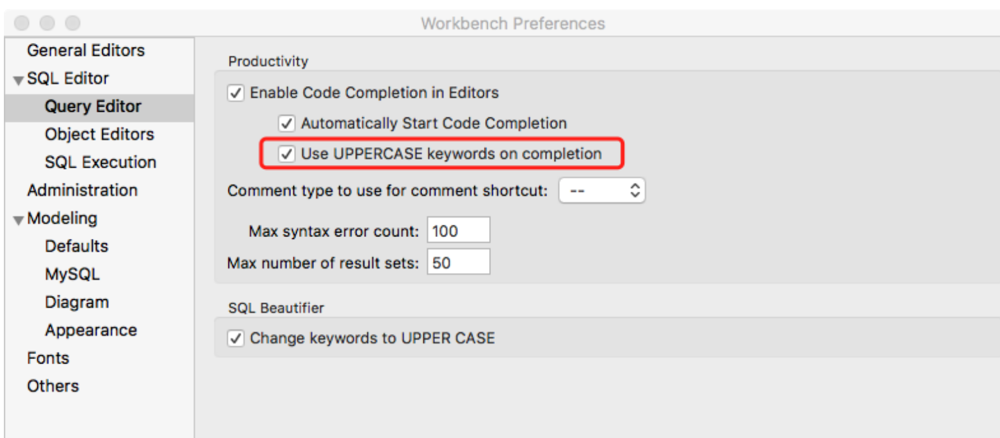

[toc]


# WorkBench

## 安装workbench(可视化软件)

```shell
sudo apt install mysql-workbench-community #安装
~/sysDownload/mysql mysql-workbench #启动成功
Found /lib/x86_64-linux-gnu/libproj.so.15
```

- 启动workbench ` mysql-workbench #启动成功`

## 使用

#### 数据库连接

需要创建一个用户(默认的root用户我没有链接上，应该是权限问题，因此先在terminal中创建一个guest用户)

- 创建用户：

  ```shell
  mysql> CREATE USER 'boss'@'localhost' IDENTIFIED BY '1';
  Query OK, 0 rows affected (0.02 sec)
  ```

  为了后面使用该用户方便，需要赋予该用户全部权限

  ```shell
  mysql> GRANT All Privileges ON *.* TO boss@"localhost";
  Query OK, 0 rows affected (0.00 sec)
  ```

- 在workbench中连接：

  - 创建连接

    首页选择创建链接

    
  
    填写信息：
  
    - 所有信息（hostname、username、password等都是之前在mysql数据库中存在的用户信息）符合已存在的用户
  
  
  
  - 连接成功：
  
  


#### 创建new shema



#### 导入新的脚本

- 在mysql中执行的脚本

```shell
mysql> USE crashcourse; #选择数据库 
mysql> source /home/yang/Learn/learnMysql/mysql_must_know_data/mysql_scripts/populate.sql;
Query OK, 1 row affected (0.00 sec)
```


创建完成：

```shell
mysql> 
mysql> show tables;
+-----------------------+
| Tables_in_crashcourse |
+-----------------------+
| customers             |
| orderitems            |
| orders                |
| productnotes          |
| products              |
| vendors               |
+-----------------------+
6 rows in set (0.00 sec)
```


## 其他设置

#### 关键字自动大写

MySQLWorkbench -> preferences -> SQL Editor -> Query Editor -> Use UPPERCASE keywords on completion



[参考链接](https://www.cnblogs.com/liuchao233/p/6962379.html)


## 快捷键

[快捷键汇总](https://www.cnblogs.com/Lints/p/11524531.html)

执行当前语句 ： `ctrl+enter`

格式化sql语句（美化sql语句）：ctrl+b 