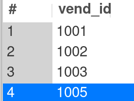
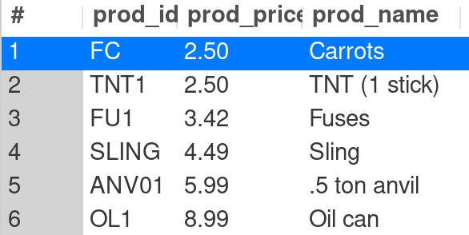
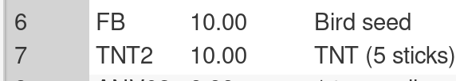

[toc]


# 4 检索数据

## 4.1 SELECT语句

#### 检索列

```mysql
检索列
SELECT prod_id, prod_name, prod_price FROM products;
检索多个列
SELECT prod_id, prod_name, prod_price FROM products;
检索所有列
SELECT * FROM products;
```


## 4.2 DISTINCT

#### distinct关键字

distinct 只返回不同的值（去除重复的行）

```mysql
SELECT DISTINCT vend_id from products ;
```


## 4.3 LIMIT

- 仅查询前N行

```mysql
SELECT DISTINCT vend_id from products limit 2;
```

- 查询指定某几行

  表示从第三行开始(不包含3行)往后要选择的行数。要想显示第一行需要从0行开始（通常省略）。

  - 如果行数不够则直接返回最少的行数

```mysql
SELECT DISTINCT vend_id from products limit 3,1; 
```

比如：

下面如果 limit 0,2; 则会选择1,2两行。

如果limit 1,2 ; 则会选择2，3行




## 4.4`.`完全限定表名

限定要查询的列名、表属于限定的某个数据库

```mysql
SELECT products.prod_name FROM crashcourse.products;
```


# 5 排序检索数据ORDER

> 使用`ORDER BY` 子句来对检索到的数据排序


### 5.1 ORDER BY排序

- 单列排序

```mysql
SELECT prod_name FROM products ORDER BY prod_name;
```

- 多列排序

  - 其中ODERBY后面列名出现的顺序决定了排序的顺序

    比如 `prod_price, prod_name`是先价格后名字，反过来写就是先名字后价格

```mysql
SELECT prod_id, prod_price, prod_name FROM products ORDER BY prod_price, prod_name; -- 先按照价格排好序后，相同价格再按照name排序
```



### 5.2 DESC 降序

- 单列降序

  默认排序是升序，在需要降序排列的列名后面加上DESC就是该列降序

```mysql
SELECT prod_id, prod_price, prod_name FROM products ORDER BY prod_name DESC;  -- 按照名字降序排列
```

- 多列降序,升序

  先按照价格降序，在相同的价格的几行中名字升序排列

```mysql
SELECT prod_id, prod_price, prod_name FROM products ORDER BY prod_price DESC, prod_name; 
```



​		一个 `DESC` 关键字影响范围只有自己前面紧邻的那一列，想要所有列都降序需要每个列名后面都加上DESC


- 结合LIMIT 找到最大(最小数值)

```mysql
-- 找最昂贵的产品
SELECT prod_price, prod_name FROM products ORDER BY prod_price DESC LIMIT 1;
```


