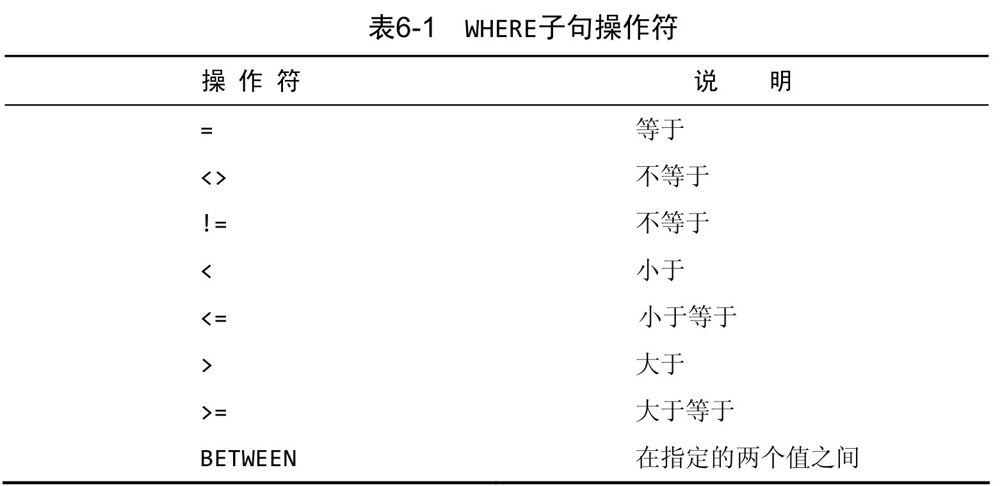
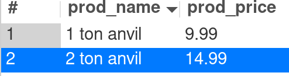
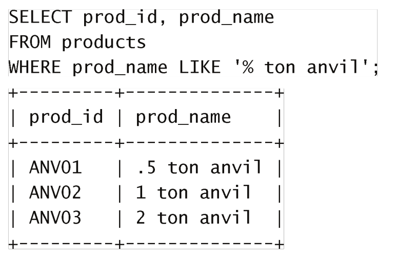

# 6 过滤数据WHERE


## 6.1 WHERE

**WHERE是对查询结果的筛选**

- WHERE关键字要位于ORDER BY关键字的前面，否则会报错。
  - WHERE是对数据的筛选，order需要处理的内容是一个固定的结果。如果WHERE在后面，order已经排序了的数据有一部分会被过滤掉

```mysql
SELECT prod_name, prod_price FROM products WHERE prod_price = 2.5;
```


## 6.2 WHERE对应操作符




```mysql
-- 检查单个值
SELECT prod_name, prod_price FROM products WHERE prod_price = 2.5;

-- 指定两个值之间
SELECT prod_name, prod_price FROM products WHERE prod_price BETWEEN 5 AND 9;

-- 不等于
SELECT prod_name, prod_price FROM products WHERE prod_price <> 10;

-- 某值为空
SELECT prod_name, prod_price FROM products WHERE prod_price IS NULL;
```


# 7 WHERE子句,IN NOT

## 7.1 子句AND,OR

**1. 语法**

and：前后两个条件同时满足

```mysql
-- AND
SELECT prod_id, prod_price, prod_name FROM products WHERE vend_id = 1003 AND prod_price <= 10 ;

-- OR
SELECT prod_id, prod_price, prod_name FROM products WHERE vend_id = 1003 OR prod_price <= 10;
```


**2. 计算次序：**

- AND计算次序高于OR
- 如果要先计算OR需要加括号


举例：

下面语句中未加括号，先计算AND部分。

结果是：供货商是1002 且 价格 >= 10的商品 或者供货商为1003的产品

```mysql
SELECT prod_id, prod_price, prod_name FROM products WHERE vend_id = 1003 OR vend_id = 1002 AND prod_price >= 10;
```


要想获得：供货商为1002和1003的产品，并且这些产品都价格小于10需要在OR部分加上括号

```mysql
SELECT prod_id, prod_price, prod_name FROM products WHERE (vend_id = 1003 OR vend_id = 1002) AND prod_price >= 10;
```


### 7.2 IN

IN WHERE 子句：IN指定某个范围，来获取范围内的结果，括号内每个条件都可以匹配，作用与OR类似


语法: `WHERE std IN (....)`

```mysql 
-- 查找供货商id为1003和1002的全部商品
SELECT prod_id, prod_price, prod_name FROM products WHERE vend_id IN (1002, 1003);
```


- 为什么要使用IN？
  - IN比OR执行速度快
  - IN 的最大优点是可以包含其他 SELECT 语句,使得能够更动态地建
    立 WHERE 子句。
  -  在使用长的合法选项清单时, IN 操作符的语法更清楚且更直观。
  -  在使用 IN 时,计算的次序更容易管理(因为使用的操作符更少)


### 7.3 NOT


功能： 否定他之后跟着的关键字

```mysql
-- NOT
SELECT prod_id, prod_price, prod_name FROM products WHERE vend_id NOT IN (1002, 1003) ORDER BY prod_name;;
```


MySQL中的NOT：

mysql中的NOT只能对INT、BETWEEN、EXISTS取反。相比于其他的BDSM可以对各种条件取反有区别


# 8 通配符过滤

## 8.1 LIKE

### %通配符

作用：匹配0、1、多个字符

使用：

```mysql
LIKE '%anvil%'
LIKE LIKE 'a%l'
LIKE '%'
```

例子：

```mysql
SELECT prod_name, prod_price FROM products WHERE prod_name LIKE '%anvil%';
```


ATEENTION：

- `'%'` 不会匹配值为NULL的对象


### _下划线通配符

匹配单个字符

```mysql
SELECT prod_name, prod_price FROM products WHERE prod_name LIKE '_ ton anvil';
```




- `_` 仅能匹配一个字符，与 `%`区别




