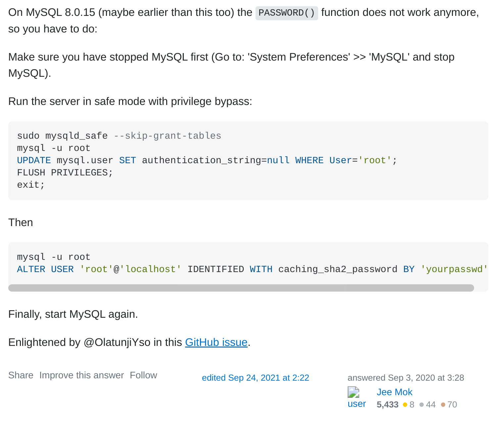

# 错误

```bash
ERROR 1045 (28000): Access denied for user 'root'@'localhost' (using password: YES)
```


## 解决


[解决方法](https://www.origrata.com/2020/05/error-1045-28000-access-denied-for-user.html)

[更新root用户密码](https://stackoverflow.com/posts/63716361/edit)


```bash
# =====================停止mysql
root@origrata:~# /etc/init.d/mysql stop
[ ok ] Stopping mysql (via systemctl): mysql.service.
root@origrata:~# mkdir /var/run/mysqld
root@origrata:~# chown mysql /var/run/mysqld
# =================启动安全模式
root@origrata:~# mysqld_safe --skip-grant-tables&
[1] 2076
root@origrata:~# 2020-05-16T07:55:57.688113Z mysqld_safe Logging to '/var/log/mysql/error.log'.
2020-05-16T07:55:57.708584Z mysqld_safe Starting mysqld daemon with databases from /var/lib/mysql
#=================设置root密码，刷新权限 （这部分采用对应版本的更新root密码的方式）
root@origrata:~# mysql --user=root mysql
mysql> UPDATE mysql.user SET authentication_string=null WHERE User='root';
Query OK, 1 row affected (0.01 sec)
Rows matched: 1  Changed: 1  Warnings: 0

mysql> FLUSH PRIVILEGES;
Query OK, 0 rows affected (0.00 sec)

mysql> exit
Bye
#====================重新进入mysql 设置新密码
VM# mysql -u root
mysql> ALTER USER 'root'@'localhost' IDENTIFIED WITH caching_sha2_password BY '1'; 
Query OK, 0 rows affected (0.01 sec)

#===================完成设置，测试是否成功:成功！
mysql -u root -p
Enter password: 
.....
mysql> 
```


